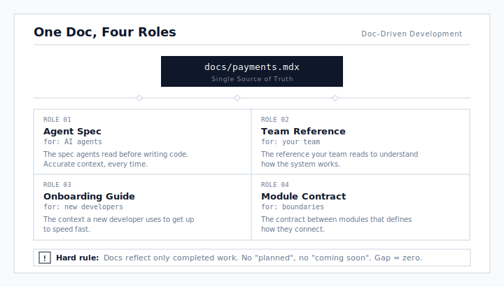
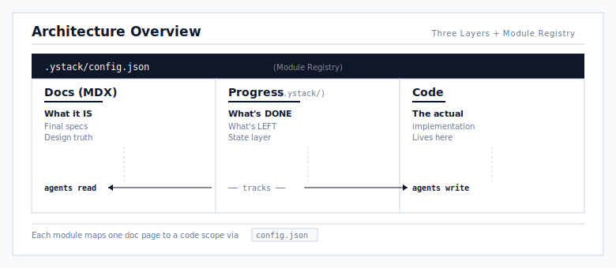
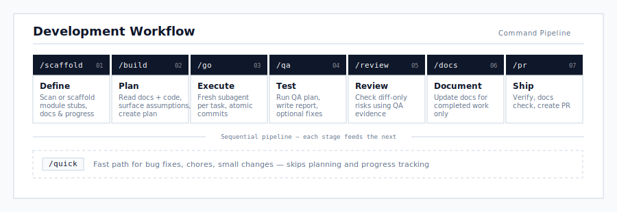

<!-- logo -->
<p align="center">
  
</p>

[](https://www.npmjs.com/package/ystack)
[](./LICENSE)

**An agent harness for doc-driven development** — with git-native progress tracking.

**[English](./README.md)** | **[中文](./README.zh-CN.md)**

```bash
# Skills only (via skills.sh)
npx skills add yulonghe97/ystack

# Full install — skills + agent linting hooks
npx ystack init

# New project from scratch
npx ystack create my-app && cd my-app

# Then run /create in your coding agent to set up the project
```

---

## Why

Most AI agent setups have a dirty secret: the context they feed the agent is separate from the docs humans read. You end up maintaining two sources of truth — one rots, the other drifts, and neither is reliable.

ystack makes your documentation site the single source of truth for both humans and agents.

<p align="center">
  
</p>

**Hard rule: docs reflect only completed work.** No "planned", no "coming soon", no six-month-old TODOs. If it's in the docs, it's built, verified, and working. The gap between docs and reality is always zero.

This means agents get accurate context every time — not hallucinated architecture, not aspirational specs, not stale planning artifacts that nobody maintains.

See [PHILOSOPHY.md](./PHILOSOPHY.md) for the full design rationale.

---

## How It Works

Three layers, connected by a module registry:

<p align="center">
  
</p>

Each module maps a doc page and code scope:

```json
{
  "modules": {
    "payments": {
      "doc": "shared/payments",
      "scope": ["packages/payments/**", "apps/api/src/routes/payments.*"]
    }
  }
}
```

---

## The Workflow

<p align="center">
  
</p>

### Commands

| Command | What it does |
|---------|-------------|
| `/create` | Set up a new or existing project — recommends stack, adapts to your needs |
| `/scaffold` | Takes a big plan, splits into module doc stubs + diagrams + progress files |
| `/import` | Scans existing repo, generates module registry, flags doc gaps |
| `/build <feature>` | Reads docs + code, surfaces assumptions, creates a plan. You confirm. |
| `/go` | Executes the plan — fresh subagent per task, atomic commits |
| `/qa [--fix]` | Runs plan-driven QA and writes `QA-REPORT.md`; `--fix` opts into automatic remediation |
| `/quick` | Fast path for bug fixes, chores, small changes — skip planning and progress |
| `/review` | QA-aware code review — trusts `QA-REPORT.md` evidence and checks diff-only risks |
| `/docs` | Updates documentation for completed work (only completed, never planned) |
| `/pr` | Verify, docs check, create PR |
| `/address-review` | Fetch PR review comments, triage by priority, address approved fixes |

---

## Getting Started

### Install

```bash
# Option A: skills only (via skills.sh)
npx skills add yulonghe97/ystack

# Option B: skills + agent linting hooks
cd your-project && npx ystack init

# Option C: new project from scratch
npx ystack create my-app && cd my-app
```

Option A installs just the skills. Options B and C also install [agent linting hooks](./LINTING.md) that enforce the doc-driven workflow (read spec before coding, plan before executing, verify before shipping).

Then run `/create` in your coding agent to set up the project — it recommends a default stack (Turborepo + pnpm + TypeScript + Ultracite + Nextra) but adapts to whatever you prefer.

See [INSTALL.md](./INSTALL.md) for full setup options and configuration.

## Documentation

- [PHILOSOPHY.md](./PHILOSOPHY.md) — Design principles and rationale
- [INSTALL.md](./INSTALL.md) — Installation and default stack
- [LINTING.md](./LINTING.md) — Agent linting rules
- [RUNTIMES.md](./RUNTIMES.md) — Multi-runtime support

## Contributing

Issues and PRs welcome. Please open an issue before starting large changes.

## Changelog

See [CHANGELOG.md](./CHANGELOG.md) for release history.

## License

MIT
