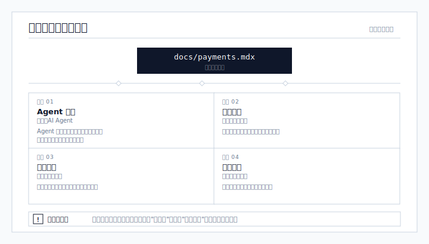
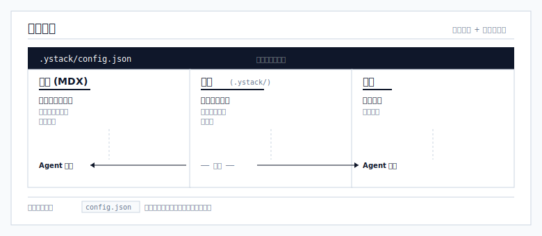
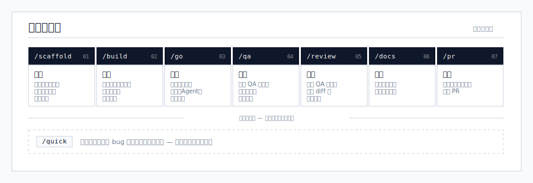

<!-- logo -->
<p align="center">
  
</p>

[](https://www.npmjs.com/package/ystack)
[](./LICENSE)

**文档驱动开发的 Agent 框架** — 搭配 Git 原生的进度追踪。

**[English](./README.md)** | **[中文](./README.zh-CN.md)**

```bash
# 交互式设置向导
npx ystack

# 使用预设配置创建新项目
npx ystack create my-app

# 在现有项目中初始化
cd your-project && npx ystack init
```

---

## 为什么选择 ystack

大多数 AI Agent 方案都有一个不能说的秘密：喂给 Agent 的上下文和人类阅读的文档是分开维护的。你最终需要维护两个"事实来源"——一个在腐烂，另一个在偏移，两个都不可靠。

ystack 让你的文档站成为人类和 Agent 共享的唯一事实来源。

<p align="center">
  
</p>

**硬性规则：文档仅反映已完成的工作。** 没有"计划中"，没有"即将推出"，没有半年前的 TODO。如果写在文档里，就代表已构建、已验证、正在运行。文档与现实的差距永远为零。

这意味着 Agent 每次都能获得准确的上下文——不是幻想出来的架构，不是理想化的规格，不是没人维护的陈旧规划。

详见 [PHILOSOPHY.md](./PHILOSOPHY.md) 了解完整设计理念。

---

## 工作原理

三层架构，通过模块注册表连接：

<p align="center">
  
</p>

每个模块映射一个文档页面和代码范围：

```json
{
  "modules": {
    "payments": {
      "doc": "shared/payments",
      "scope": ["packages/payments/**", "apps/api/src/routes/payments.*"]
    }
  }
}
```

---

## 开发工作流

<p align="center">
  
</p>

### 命令列表

| 命令 | 功能说明 |
|------|---------|
| `/scaffold` | 将大规划拆分为模块文档骨架 + 图表 + 进度文件 |
| `/import` | 扫描现有仓库，生成模块注册表，标记文档缺口 |
| `/build <feature>` | 读取文档和代码，暴露假设，生成计划。由你确认。 |
| `/go` | 执行计划 — 每个任务一个全新子 Agent，原子提交 |
| `/quick` | 快速通道：用于 bug 修复、杂务、小改动 — 跳过规划与进度 |
| `/review` | 代码审查 + 以目标为导向的逆向验证 |
| `/docs` | 为已完成的工作更新文档（仅已完成，绝不写"计划中"） |
| `/pr` | 验证、文档检查、创建 PR |
| `/address-review` | 获取 PR 审查评论，按优先级分类，处理已批准的修复 |

---

## 快速开始

```bash
# 新项目
npx ystack create my-app

# 现有项目
cd your-project
npx ystack init
```

详见 [INSTALL.md](./INSTALL.md) 了解完整安装选项、前置条件与配置。

## 文档

- [PHILOSOPHY.md](./PHILOSOPHY.md) — 设计原则与理念
- [INSTALL.md](./INSTALL.md) — 安装与默认技术栈
- [LINTING.md](./LINTING.md) — Agent 代码检查规则
- [RUNTIMES.md](./RUNTIMES.md) — 多运行时支持

## 贡献

欢迎提交 Issue 和 PR。请在开始大规模修改前先开一个 Issue。

## 更新日志

见 [CHANGELOG.md](./CHANGELOG.md) 了解版本历史。

## 许可证

MIT
