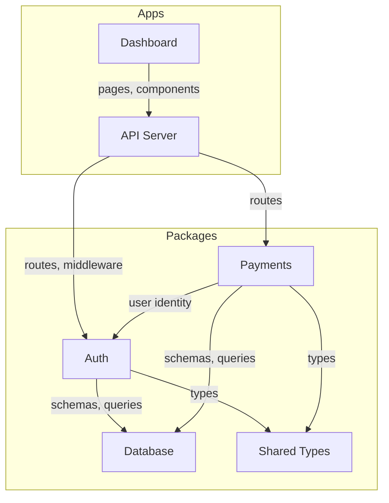

# /scaffold — Scaffold Documentation from a Plan

Two modes:
- **Full project** (`/scaffold` with a project plan) — scaffold all modules for a new project
- **Single module** (`/scaffold <module-name>` in an existing project) — add one new module

**You produce structure, not detail.** Module overviews get purpose statements and feature stubs. The detail fills in later via `/docs` as features are implemented.

---

## Mode Detection

1. If `.ystack/config.json` exists AND the user provides a module name or a module-level plan (not a full project plan):
   → **Single-module mode** (jump to [Single-Module Flow](#single-module-flow))

2. Otherwise:
   → **Full-project mode** (continue below)

## Phase 0: Get the Plan

1. If the user passed a file path, read it:
   ```bash
   cat <path-to-plan.md>
   ```

2. If the user pasted the plan inline, use that.

3. If no plan was provided, ask:
   > Provide a project plan — a markdown document describing the modules, their features,
   > and how they connect. This can be rough. Example:
   >
   > ```markdown
   > # MyApp
   >
   > ## Auth
   > - Email/password login
   > - OAuth (Google, GitHub)
   > - Connects to: Database, API
   >
   > ## Payments
   > - Stripe integration
   > - Wallet with balance
   > - Connects to: Auth, Database
   > ```

## Phase 1: Parse the Plan

Extract structured data from the freeform plan.

### Extract modules

For each module, identify:
- **Name** — the module identifier (e.g., "Auth", "Payments")
- **Features** — bullet points under the module (e.g., "Email/password login", "Stripe integration")
- **Connections** — other modules this one references (from "Connects to:", "depends on", "uses", "calls", or contextual mentions)
- **Type** — classify as `app` or `package`:
  - `app` = has a UI, runs as a server, or is a user-facing entry point (dashboard, API server, docs site)
  - `package` = a library consumed by apps or other packages (auth, payments, database, shared types)

### Extract system-level info

- **Project name** — from the top-level heading or first line
- **Project description** — from any introductory text before the first module
- **Cross-cutting concerns** — things mentioned as shared (database, auth, API gateway, shared types)

### Handle ambiguity

Plans are freeform. Handle common patterns:

| Input pattern | Interpretation |
|--------------|---------------|
| `## Module Name` with bullets | Module with features |
| `### Sub-section` under a module | Sub-module (group under parent) |
| `- Connects to: X, Y` | Dependencies on modules X and Y |
| `- Uses X for Y` | Dependency on module X |
| `Database` / `DB` mentioned | Shared database package |
| `API` mentioned as a connection | API server app |
| Feature mentions another module | Implicit dependency |

If the plan structure is genuinely unclear, ask one clarifying question — don't ask five.

### Present the parsed structure

Before generating anything, show the user what you extracted:

```
I've parsed your plan into:

Modules (6):
  apps/
    api          — API server (3 features)
    dashboard    — User dashboard (4 features)
  packages/
    auth         — Authentication (3 features)
    payments     — Payment processing (2 features)
    db           — Database schema and client
    shared       — Shared types and utilities

Connections:
  auth → db
  payments → auth, db
  dashboard → auth, payments, api
  api → auth, payments, db

Does this look right? I'll generate the doc structure from this.
```

**Wait for confirmation.**

## Phase 2: Generate Architecture Diagram

Create a system-level Mermaid diagram showing all modules and their connections.

### Diagram rules

- Use `graph TB` (top-to-bottom) for systems with clear layers (apps on top, packages below)
- Use `graph LR` (left-to-right) for pipeline-style systems
- Group with `subgraph`:
  - `subgraph Apps` for apps
  - `subgraph Packages` for packages
- Label edges with what flows between modules:
  ```
  auth -->|"sessions, tokens"| api
  payments -->|"balance, transactions"| dashboard
  ```
- If a connection type isn't clear from the plan, use a plain arrow (no label)
- Keep under 20 nodes — combine utility packages if needed
- Style future/planned nodes with dashed borders:
  ```
  style future_module fill:#f8f8f8,stroke:#ccc,stroke-dasharray: 5 5
  ```

### Example output



## Phase 3: Generate Doc Pages

Create the documentation structure. Each module gets an overview page with stubs.

### Docs directory structure

Read `.ystack/config.json` `docs.framework` to determine the structure. If no config exists, detect from the project.

**Nextra:**
```
docs/src/content/
├── _meta.ts                    # Top-level navigation
├── index.mdx                   # Project home page
├── <module-a>/
│   ├── _meta.ts                # Module navigation
│   └── index.mdx               # Module overview
└── ...
```

**Fumadocs:**
```
content/docs/
├── meta.json                   # Top-level navigation
├── index.mdx                   # Project home page
├── <module-a>/
│   ├── meta.json               # Module navigation
│   └── index.mdx               # Module overview
└── ...
```

If the docs directory doesn't exist yet, note that it needs to be created with the Nextra/Fumadocs setup (handled by `npx ystack create`, not this skill).

If the docs directory already exists, merge with existing content — don't overwrite.

### Project home page (`index.mdx`)

```markdown
# <Project Name>

> <one-line description from the plan>

## Architecture

```mermaid
<the architecture diagram from Phase 2>
```

1. **<Module A>** — <one-sentence purpose>
2. **<Module B>** — <one-sentence purpose>
...

## Modules

| Module | Type | Purpose |
|--------|------|---------|
| [**<Module A>**](/<module-a>) | app | <one sentence> |
| [**<Module B>**](/<module-b>) | package | <one sentence> |
...
```

### Top-level navigation

**Nextra** (`_meta.ts`):
```typescript
export default {
  index: { title: "Home" },
  "---modules": { type: "separator", title: "Modules" },
  "<module-a-slug>": "<Module A Display Name>",
  "<module-b-slug>": "<Module B Display Name>",
};
```

**Fumadocs** (`meta.json`):
```json
{
  "title": "<Project Name>",
  "pages": ["index", "<module-a-slug>", "<module-b-slug>"]
}
```

Order modules logically: apps first, then packages, or by dependency order (upstream first).

### Module overview page (`<module>/index.mdx`)

For each module, generate a stub overview:

```markdown
# <Module Name>

> <one-sentence purpose derived from the plan>

## Purpose

<2-3 sentences expanding on what this module does and why it exists. Derived from the plan's description and the module's features. Keep it high-level — the detail comes later.>

## Scope

### In Scope
<bullet list of features from the plan>

### Out of Scope
<leave empty or add obvious exclusions based on module boundaries>

## Dependencies

### Needs
| Module | What this module needs |
|--------|-----------------------|
| [**<Dep A>**](/<dep-a>) | <what it uses — inferred from connections> |

### Provides
- <what other modules consume from this one — inferred from reverse connections>

## Sub-modules

| Sub-module | What it does |
|------------|-------------|
| <feature-stub-1> | <one sentence from plan> |
| <feature-stub-2> | <one sentence from plan> |

*Detail pages for each sub-module will be created as features are implemented.*
```

### Module navigation

**Nextra** (`_meta.ts`):
```typescript
export default {
  index: "Overview",
};
```

**Fumadocs** (`meta.json`):
```json
{
  "pages": ["index"]
}
```

Sub-module pages are NOT created yet — just the overview with a stub table. Pages get created by `/docs` as features are built and verified.

### Writing rules for stubs

- **Purpose statements** should be concrete: "Handles Stripe integration for wallet top-ups and spend tracking" not "Manages payments"
- **Feature stubs** are one-liners from the plan — just enough to know what goes here
- **Dependencies** inferred from connections — if the plan says "Payments connects to Auth", then Payments needs Auth
- **No implementation detail** — these are design stubs, not code documentation
- **No planning language** — no "will be implemented", "planned for v1". Write as if describing the finished system: "Handles OAuth login via Google and GitHub"
- **Cross-reference every module mention** — `[Auth](/auth)` not just "Auth"

## Phase 4: Generate Module Registry

Create `.ystack/config.json`:

```json
{
  "project": "<project-name>",
  "docs": {
    "root": "docs/src/content",
    "framework": "nextra"
  },
  "modules": {
    "<module-a-slug>": {
      "doc": "<module-a-slug>",
      "scope": ["<apps-or-packages>/<module-a-slug>/**"]
    },
    "<module-b-slug>": {
      "doc": "<module-b-slug>",
      "scope": ["<apps-or-packages>/<module-b-slug>/**"]
    }
  }
}
```

Notes:
- `scope` uses glob patterns — a module can span multiple packages or be a subdirectory within one
- Sub-modules are tracked by docs (sub-pages). Features are tracked in progress files (`.ystack/progress/<module>.md`). The registry only tracks modules.
- The `doc` path is relative to `docs.root`

## Phase 5: Create Progress Files

Create a progress file per module in `.ystack/progress/`:

For each module, write `.ystack/progress/<module-slug>.md`:

```markdown
# <Module Name>

## Features
- [ ] <Feature 1>           → <module-slug>#<feature-anchor>
- [ ] <Feature 2>           → <module-slug>#<feature-anchor>
- [ ] <Feature 3>           → <module-slug>#<feature-anchor>
      depends-on: <Feature 1>

## Decisions
| Date | Feature | Decision |
|------|---------|----------|

## Notes
```

For inter-module dependencies, use `depends-on:` annotations on the checklist items.

Create `.ystack/progress/_overview.md`:

```markdown
# Project Progress

## Module Status

| Module | Done | Total | Status |
|--------|------|-------|--------|
| auth | 0 | 3 | not started |
| payments | 0 | 2 | not started |
| dashboard | 0 | 4 | not started |

## Dependencies

auth/sessions → auth/oauth
payments/stripe → payments/wallet → dashboard/usage

## Ready Front

- auth/email-login (no dependencies)
- auth/sessions (no dependencies)
- payments/stripe (no dependencies)
```

## Phase 6: Present the Result

Show the user what was generated:

```
## Scaffold Complete

### Architecture
[the Mermaid diagram]

### Docs Structure
  docs/src/content/
  ├── index.mdx (project overview)
  ├── auth/index.mdx (3 feature stubs)
  ├── payments/index.mdx (2 feature stubs)
  ├── dashboard/index.mdx (4 feature stubs)
  └── api/index.mdx (3 feature stubs)

### Module Registry
  .ystack/config.json — 6 modules registered

### Progress
  6 progress files created, 15 features tracked
  Ready front: auth/email-login, db/schema-setup (no blockers)

### Next Steps
  1. Pick a module to start with — check `.ystack/progress/_overview.md` for the ready front
  2. `/build <feature>` to plan the first feature
  3. Doc pages will fill in as features are built via `/docs`
```

---

## Single-Module Flow

Use this flow when adding a new module to an existing project that already has `.ystack/config.json` and a docs site.

**Trigger:** `/scaffold <module-name>` or `/scaffold` with a module-level plan (not a full project plan) in a project with an existing `.ystack/config.json`.

### Step 1: Get the Module Plan

1. If the user provided a module name with no description, ask:
   > Describe the **<module-name>** module — what it does, its features, and what existing modules it connects to. Example:
   >
   > ```markdown
   > ## Notifications
   > - Email notifications (transactional, marketing)
   > - Push notifications (mobile, web)
   > - Notification preferences per user
   > - Connects to: Auth, Payments
   > ```

2. If the user provided a description (inline or file), use that.

### Step 2: Parse and Confirm

Extract from the module plan:
- **Name** and **slug** (e.g., "Notifications" → `notifications`)
- **Type** — `app` or `package`
- **Features** — bullet points
- **Connections** — which existing modules it connects to (verify these exist in `.ystack/config.json`)

Read the existing `.ystack/config.json` to understand what modules already exist.

Present:
```
Adding module to existing project:

  notifications (package) — 3 features
    Connects to: auth, payments

Existing modules: auth, payments, dashboard, api, db

Proceed?
```

**Wait for confirmation.**

### Step 3: Create Doc Page

1. Read the existing docs structure to find the docs root and framework.

2. Create the module overview page using the same template as full-project mode:
   - `<docs-root>/<module-slug>/index.mdx` — overview with Purpose, Scope, Dependencies, Sub-modules
   - `<docs-root>/<module-slug>/_meta.ts` (Nextra) or `meta.json` (Fumadocs)

3. Update top-level navigation to include the new module:
   - Nextra: add entry to `<docs-root>/_meta.ts`
   - Fumadocs: add entry to `<docs-root>/meta.json`

4. Update the project home page (`<docs-root>/index.mdx`):
   - Add the new module to the architecture Mermaid diagram (add node + connection edges)
   - Add row to the modules table

### Step 4: Update Module Registry

Read and update `.ystack/config.json`:

```json
{
  "modules": {
    // ... existing modules ...
    "<module-slug>": {
      "doc": "<module-slug>",
      "scope": ["<apps-or-packages>/<module-slug>/**"]
    }
  }
}
```

### Step 5: Create Progress File

Write `.ystack/progress/<module-slug>.md`:

```markdown
# <Module Name>

## Features
- [ ] <Feature 1>           → <module-slug>#<feature-anchor>
- [ ] <Feature 2>           → <module-slug>#<feature-anchor>

## Decisions
| Date | Feature | Decision |
|------|---------|----------|

## Notes
```

Add dependencies to existing module features where connections exist.
Update `.ystack/progress/_overview.md` to include the new module.

### Step 6: Present Summary

```
## Module Added: <Module Name>

### Docs
  <docs-root>/<module-slug>/index.mdx — overview with 3 feature stubs

### Registry
  .ystack/config.json — module added

### Progress
  progress file created, 3 features tracked

### Architecture Diagram
  Updated — <module-slug> connected to auth, payments

### Next Steps
  1. `/build <feature>` to plan the first feature in this module
  2. Doc detail will fill in as features are built via `/docs`
```

---

## What This Skill Does NOT Do

- **Does not scaffold code.** No package.json, no source files, no configs. That's `npx ystack create`.
- **Does not write detailed specs.** Only stubs — purpose, scope, dependency tables. Detail comes from `/docs` after features are built.
- **Does not set up Turborepo/Nextra/Ultracite.** That's the installer's job.
- **Does not create sub-module pages.** Only module overviews with stub tables. Pages are created by `/docs` when features complete.
- **Does not make up features.** Only includes what the plan describes. If the plan is vague, the stubs are vague.
