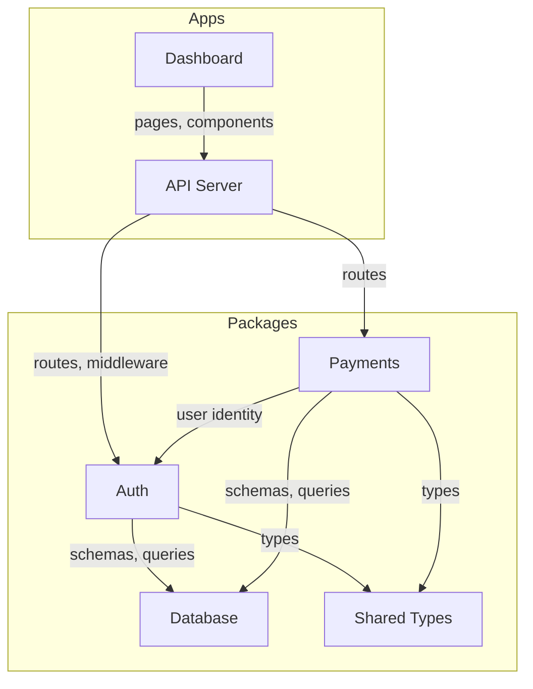

# /skeleton — Scaffold a Project from a Plan

You take a rough project plan and produce a documentation skeleton — module overview pages, architecture diagrams, navigation, module registry, and Beads epics. This is the starting point for a new project.

**You produce structure, not detail.** Module overviews get purpose statements and feature stubs. The detail fills in later via `/docs` as features are implemented.

## Phase 0: Get the Plan

1. If the user passed a file path, read it:
   ```bash
   cat <path-to-plan.md>
   ```

2. If the user pasted the plan inline, use that.

3. If no plan was provided, ask:
   > Provide a project plan — a markdown document describing the modules, their features,
   > and how they connect. This can be rough. Example:
   >
   > ```markdown
   > # MyApp
   >
   > ## Auth
   > - Email/password login
   > - OAuth (Google, GitHub)
   > - Connects to: Database, API
   >
   > ## Payments
   > - Stripe integration
   > - Wallet with balance
   > - Connects to: Auth, Database
   > ```

## Phase 1: Parse the Plan

Extract structured data from the freeform plan.

### Extract modules

For each module, identify:
- **Name** — the module identifier (e.g., "Auth", "Payments")
- **Features** — bullet points under the module (e.g., "Email/password login", "Stripe integration")
- **Connections** — other modules this one references (from "Connects to:", "depends on", "uses", "calls", or contextual mentions)
- **Type** — classify as `app` or `package`:
  - `app` = has a UI, runs as a server, or is a user-facing entry point (dashboard, API server, docs site)
  - `package` = a library consumed by apps or other packages (auth, payments, database, shared types)

### Extract system-level info

- **Project name** — from the top-level heading or first line
- **Project description** — from any introductory text before the first module
- **Cross-cutting concerns** — things mentioned as shared (database, auth, API gateway, shared types)

### Handle ambiguity

Plans are freeform. Handle common patterns:

| Input pattern | Interpretation |
|--------------|---------------|
| `## Module Name` with bullets | Module with features |
| `### Sub-section` under a module | Sub-module (group under parent) |
| `- Connects to: X, Y` | Dependencies on modules X and Y |
| `- Uses X for Y` | Dependency on module X |
| `Database` / `DB` mentioned | Shared database package |
| `API` mentioned as a connection | API server app |
| Feature mentions another module | Implicit dependency |

If the plan structure is genuinely unclear, ask one clarifying question — don't ask five.

### Present the parsed structure

Before generating anything, show the user what you extracted:

```
I've parsed your plan into:

Modules (6):
  apps/
    api          — API server (3 features)
    dashboard    — User dashboard (4 features)
  packages/
    auth         — Authentication (3 features)
    payments     — Payment processing (2 features)
    db           — Database schema and client
    shared       — Shared types and utilities

Connections:
  auth → db
  payments → auth, db
  dashboard → auth, payments, api
  api → auth, payments, db

Does this look right? I'll generate the doc skeleton from this.
```

**Wait for confirmation.**

## Phase 2: Generate Architecture Diagram

Create a system-level Mermaid diagram showing all modules and their connections.

### Diagram rules

- Use `graph TB` (top-to-bottom) for systems with clear layers (apps on top, packages below)
- Use `graph LR` (left-to-right) for pipeline-style systems
- Group with `subgraph`:
  - `subgraph Apps` for apps
  - `subgraph Packages` for packages
- Label edges with what flows between modules:
  ```
  auth -->|"sessions, tokens"| api
  payments -->|"balance, transactions"| dashboard
  ```
- If a connection type isn't clear from the plan, use a plain arrow (no label)
- Keep under 20 nodes — combine utility packages if needed
- Style future/planned nodes with dashed borders:
  ```
  style future_module fill:#f8f8f8,stroke:#ccc,stroke-dasharray: 5 5
  ```

### Example output



## Phase 3: Generate Doc Pages

Create the documentation skeleton. Each module gets an overview page with stubs.

### Docs directory structure

```
docs/src/content/
├── _meta.ts                    # Top-level navigation (create or update)
├── index.mdx                   # Project home page with architecture diagram
├── <module-a>/
│   ├── _meta.ts                # Module navigation
│   └── index.mdx               # Module overview
├── <module-b>/
│   ├── _meta.ts
│   └── index.mdx
└── ...
```

If the docs directory doesn't exist yet, note that it needs to be created with the Nextra setup (handled by `npx ystack create`, not this skill).

If the docs directory already exists, merge with existing content — don't overwrite.

### Project home page (`index.mdx`)

```markdown
# <Project Name>

> <one-line description from the plan>

## Architecture

```mermaid
<the architecture diagram from Phase 2>
```

1. **<Module A>** — <one-sentence purpose>
2. **<Module B>** — <one-sentence purpose>
...

## Modules

| Module | Type | Purpose |
|--------|------|---------|
| [**<Module A>**](/<module-a>) | app | <one sentence> |
| [**<Module B>**](/<module-b>) | package | <one sentence> |
...
```

### Top-level `_meta.ts`

```typescript
export default {
  index: { title: "Home" },
  "---modules": { type: "separator", title: "Modules" },
  "<module-a-slug>": "<Module A Display Name>",
  "<module-b-slug>": "<Module B Display Name>",
  ...
};
```

Order modules logically: apps first, then packages, or by dependency order (upstream first).

### Module overview page (`<module>/index.mdx`)

For each module, generate a stub overview:

```markdown
# <Module Name>

> <one-sentence purpose derived from the plan>

## Purpose

<2-3 sentences expanding on what this module does and why it exists. Derived from the plan's description and the module's features. Keep it high-level — the detail comes later.>

## Scope

### In Scope
<bullet list of features from the plan>

### Out of Scope
<leave empty or add obvious exclusions based on module boundaries>

## Dependencies

### Needs
| Module | What this module needs |
|--------|-----------------------|
| [**<Dep A>**](/<dep-a>) | <what it uses — inferred from connections> |

### Provides
- <what other modules consume from this one — inferred from reverse connections>

## Sub-modules

| Sub-module | What it does |
|------------|-------------|
| <feature-stub-1> | <one sentence from plan> |
| <feature-stub-2> | <one sentence from plan> |

*Detail pages for each sub-module will be created as features are implemented.*
```

### Module `_meta.ts`

```typescript
export default {
  index: "Overview",
};
```

Sub-module pages are NOT created yet — just the overview with a stub table. Pages get created by `/docs` as features are built and verified.

### Writing rules for stubs

- **Purpose statements** should be concrete: "Handles Stripe integration for wallet top-ups and spend tracking" not "Manages payments"
- **Feature stubs** are one-liners from the plan — just enough to know what goes here
- **Dependencies** inferred from connections — if the plan says "Payments connects to Auth", then Payments needs Auth
- **No implementation detail** — these are design stubs, not code documentation
- **No planning language** — no "will be implemented", "planned for v1". Write as if describing the finished system: "Handles OAuth login via Google and GitHub"
- **Cross-reference every module mention** — `[Auth](/auth)` not just "Auth"

## Phase 4: Generate Module Registry

Create `ystack.config.json`:

```json
{
  "project": "<project-name>",
  "docs": {
    "root": "docs/src/content",
    "framework": "nextra"
  },
  "modules": {
    "<module-a-slug>": {
      "doc": "<module-a-slug>",
      "scope": ["<apps-or-packages>/<module-a-slug>/**"],
      "status": "planned"
    },
    "<module-b-slug>": {
      "doc": "<module-b-slug>",
      "scope": ["<apps-or-packages>/<module-b-slug>/**"],
      "status": "planned"
    }
  }
}
```

Notes:
- `status` starts as `"planned"` — changes to `"active"` when first feature is built
- `scope` uses glob patterns — a module can span multiple packages or be a subdirectory within one
- Sub-modules are tracked by docs (sub-pages). Features are tracked by Beads (child beads). The registry only tracks modules.
- `epic` field is added in Phase 5 after Beads creates the epics (omitted if Beads not available)
- The `doc` path is relative to `docs.root`

## Phase 5: Create Beads Epics

If Beads (`bd`) is available:

1. Create an epic per module:
   ```bash
   bd create "<Module Name>" -t epic --metadata '{"doc": "<module-slug>", "ystack": true}'
   ```

2. Create feature beads as children:
   ```bash
   bd create "<Feature description>" -t feature --parent <epic-id>
   ```

3. Add inter-module dependencies where features cross boundaries:
   ```bash
   bd dep add <feature-id> blocks:<dependent-feature-id>
   ```

4. Update `ystack.config.json` with the epic IDs:
   ```json
   {
     "modules": {
       "auth": {
         "epic": "bd-a1b2",
         ...
       }
     }
   }
   ```

If Beads is not available, skip this phase and note:
> Beads not detected. Module registry created without epic tracking.
> Run `bd init` and re-run `/skeleton` to add Beads integration.

## Phase 6: Present the Skeleton

Show the user what was generated:

```
## Skeleton Complete

### Architecture
[the Mermaid diagram]

### Docs Structure
  docs/src/content/
  ├── index.mdx (project overview)
  ├── auth/index.mdx (3 feature stubs)
  ├── payments/index.mdx (2 feature stubs)
  ├── dashboard/index.mdx (4 feature stubs)
  └── api/index.mdx (3 feature stubs)

### Module Registry
  ystack.config.json — 6 modules registered

### Beads
  6 epics, 15 feature beads created
  Ready front: auth/email-login, db/schema-setup (no blockers)

### Next Steps
  1. Pick a module to start with — run `bd ready` to see what's unblocked
  2. `/build <feature>` to plan the first feature
  3. Doc pages will fill in as features are built via `/docs`
```

---

## What This Skill Does NOT Do

- **Does not scaffold code.** No package.json, no source files, no configs. That's `npx ystack create`.
- **Does not write detailed specs.** Only stubs — purpose, scope, dependency tables. Detail comes from `/docs` after features are built.
- **Does not set up Turborepo/Nextra/Ultracite.** That's the installer's job.
- **Does not create sub-module pages.** Only module overviews with stub tables. Pages are created by `/docs` when features complete.
- **Does not make up features.** Only includes what the plan describes. If the plan is vague, the stubs are vague.
